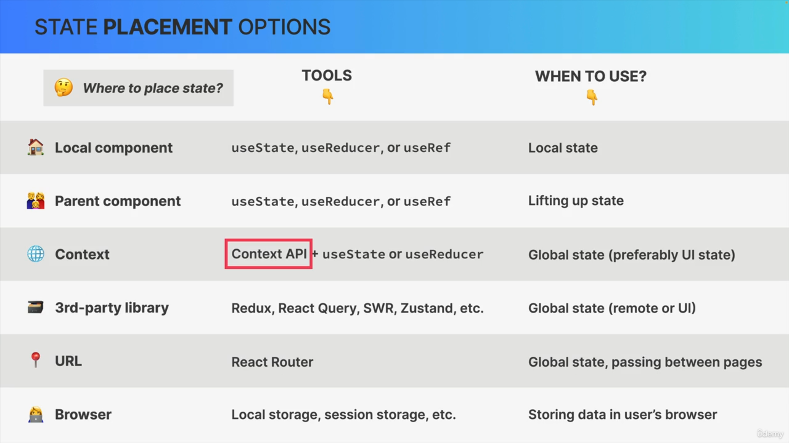
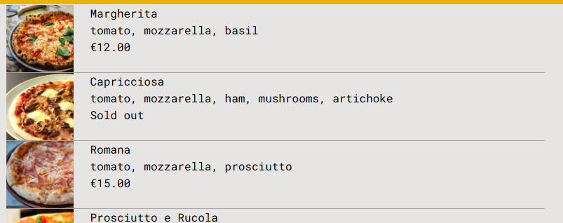
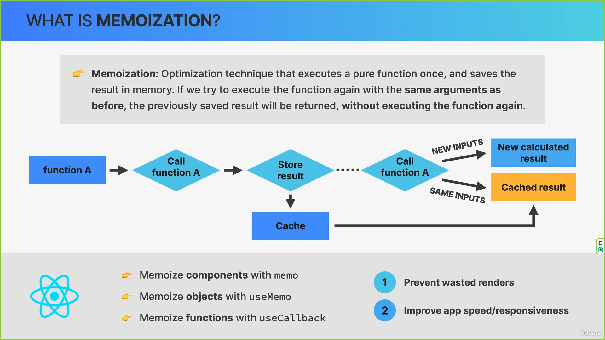
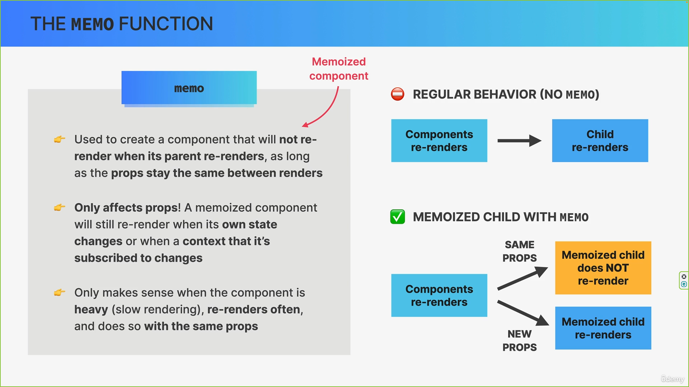

# React Best Practices and Concepts

---

## useReducer Hook

The `useReducer` hook is useful for managing complex state logic in React applications. It helps organize state updates into a predictable flow using actions and a reducer function. Unlike `useState`, which is ideal for simple state management, `useReducer` is better suited for handling multiple related state transitions.

### Example: Managing Quiz State with useReducer

```javascript
import { useReducer } from "react";

const initialState = {
  questions: [],
  status: "loading", // Possible values: loading, error, ready, active, finished
  index: 0,
  answer: null,
  points: 0,
  highscore: 0,
};

const reducer = (state, action) => {
  switch (action.type) {
    case "dataReceived":
      return { ...state, status: "ready", questions: action.payload };

    case "dataFailed":
      return { ...state, status: "error" };

    case "dataLoading":
      return { ...state, status: "loading" };

    case "start":
      return { ...state, status: "active" };

    case "newAnswer":
      const question = state.questions[state.index];
      const updatedPoints =
        question.correctOption === action.payload
          ? state.points + question.points
          : state.points;
      return { ...state, answer: action.payload, points: updatedPoints };

    case "nextQuestion":
      return { ...state, index: state.index + 1, answer: null };

    case "finish":
      const newHighscore =
        state.points > state.highscore ? state.points : state.highscore;
      return {
        ...state,
        status: "finished",
        index: 0,
        highscore: newHighscore,
      };

    case "restart":
      return { ...state, points: 0, index: 0, answer: null, status: "ready" };

    default:
      throw new Error("Unknown action type");
  }
};

const App = () => {
  const [state, dispatch] = useReducer(reducer, initialState);
  const { questions, status, index, answer, points, highscore } = state;
};
```

### How to Use

- Import `useReducer` from React.
- Define the initial state object.
- Create a reducer function that handles different state transitions.
- Use the `useReducer` hook inside a component to manage state.
- Dispatch actions to update state based on user interactions.

---

## Setting up ESLint in a Vite Project

ESLint is a popular tool for identifying and fixing problems in JavaScript code. It helps enforce best practices and maintain code quality.

### Installation

Run the following command to install ESLint in a Vite project:

```console
npm i eslint vite-plugin-eslint eslint-config-react-app --save-dev
```

### Configuration

Update the `vite.config.js` file to include ESLint as a plugin:

```javascript
import { defineConfig } from "vite";
import react from "@vitejs/plugin-react";
import eslint from "vite-plugins-eslint";

// https://vite.dev/config/
export default defineConfig({
  plugins: [react(), eslint()],
});
```

Create an `.eslintrc.json` file with the following content:

```javascript
{
  "extends": "react-app"
}
```

### How to Use

- Install ESLint and its dependencies.
- Configure Vite to use ESLint.
- Create an `.eslintrc.json` file to define linting rules.
- Run ESLint to analyze and fix code issues.

---

## Installing React Router

React Router is a library that enables routing in React applications, allowing navigation between different pages without reloading the browser.

### Installation

```console
$ npm i react-router-dom
```

### How to Use

- Install `react-router-dom` using npm.
- Import necessary components like `BrowserRouter`, `Routes`, and `Route`.
- Define different routes and associate them with corresponding components.

---

## React Router Setup

React Router enables navigation between different views in a React application. Below is a basic setup demonstrating how to define routes and navigate between them.

### Example: Basic Routing

```jsx
import { BrowserRouter, Route, Routes } from "react-router-dom";
import { ProductsPage } from "./pages/ProductsPage";
import { PricingPage } from "./pages/PricingPage";
import { HomePage } from "./pages/HomePage";
import { NotFoundPage } from "./pages/NotFoundPage";

const App = () => {
  return (
    <BrowserRouter>
      <Routes>
        <Route path="/" element={<HomePage />} />
        <Route path="pricing" element={<PricingPage />} />
        <Route path="product" element={<ProductsPage />} />
        <Route path="*" element={<NotFoundPage />} />
      </Routes>
    </BrowserRouter>
  );
};

export default App;
```

### How to Use

- Wrap your application with `BrowserRouter`.
- Use `Routes` to define all route mappings.
- Assign `Route` components with `path` and corresponding page components.
- Use `Link` from `react-router-dom` to create navigation links.

---

## Nested Routes in React Router

Nested routes allow you to define routes within a parent component, enabling better organization and modularity.

### Example: Defining Nested Routes

```jsx
import { BrowserRouter, Route, Routes } from "react-router-dom";
import { AppLayout } from "./pages/AppLayout";
import { NotFoundPage } from "./pages/NotFoundPage";

const App = () => {
  return (
    <BrowserRouter>
      <Routes>
        <Route path="app" element={<AppLayout />}>
          <Route index element={<p>Hello from index</p>} />
          <Route path="cities" element={<p>Hello from cities</p>} />
          <Route path="countries" element={<p>Hello from countries</p>} />
          <Route path="form" element={<p>Hello from form</p>} />
        </Route>
        <Route path="*" element={<NotFoundPage />} />
      </Routes>
    </BrowserRouter>
  );
};

export default App;
```

### How to Use

- Define a parent route using `Route`.
- Use `<Outlet />` inside the parent component to render nested routes.
- Nested routes will be displayed inside the parent component when their path is matched.

This structure improves code organization and allows dynamic rendering of different sections within a shared layout.

```jsx
// import React from "react";
import { Outlet } from "react-router-dom";
import { AppNav } from "./AppNav";
import { Footer } from "./Footer";
import Logo from "./Logo";

import styles from "./Sidebar.module.css";

export const Sidebar = () => {
  return (
    <div className={styles.sidebar}>
      <Logo />
      <AppNav />
      <Outlet />
      <Footer />
    </div>
  );
};
```

---

## Using URL Parameters and Query Strings in React Router

When building a React application with `react-router-dom`, handling dynamic routes and passing parameters via URL is a common requirement. This guide will cover how to:

- Use dynamic route parameters with the `useParams` hook
- Pass query strings to links
- Retrieve and manipulate query parameters using `useSearchParams`

### Setting Up Dynamic Routes with `useParams`

First, define a dynamic route in `react-router-dom` where `:id` represents the city identifier:

```jsx
<Route path="cities/:id" element={<City />} />
```

To link to this route dynamically, set up a link component:

```jsx
<Link className={styles.cityItem} to={`${id}`}>
  <span className={styles.emoji}>{emoji}</span>
  <h3 className={styles.name}>{cityName}</h3>
  <time className={styles.date}>{formatDate(date)}</time>
  <button className={styles.deleteBtn}>x</button>
</Link>
```

To retrieve the `id` from the URL inside the `City` component, use the `useParams` hook:

```jsx
import { useParams } from "react-router-dom";

const { id } = useParams();
```

### Adding Query Strings to Links

To pass additional information (such as latitude and longitude) through query parameters, modify the link as follows:

```jsx
import { Link } from "react-router-dom";
import styles from "./CityItem.module.css";

const formatDate = (date) =>
  new Intl.DateTimeFormat("en", {
    day: "numeric",
    month: "long",
    year: "numeric",
  }).format(new Date(date));

export const CityItem = ({ city }) => {
  const { cityName, emoji, date, id, position } = city;
  const { lat, lng } = position;

  return (
    <li>
      <Link className={styles.cityItem} to={`${id}?lat=${lat}&lng=${lng}`}>
        <span className={styles.emoji}>{emoji}</span>
        <h3 className={styles.name}>{cityName}</h3>
        <time className={styles.date}>{formatDate(date)}</time>
        <button className={styles.deleteBtn}>x</button>
      </Link>
    </li>
  );
};
```

### Accessing Query Parameters with `useSearchParams`

To extract and manipulate query parameters inside a component, use the `useSearchParams` hook:

```jsx
import { useSearchParams } from "react-router-dom";
import styles from "./Map.module.css";

export const Map = () => {
  const [searchParams, setSearchParams] = useSearchParams();
  const lat = searchParams.get("lat");
  const lng = searchParams.get("lng");

  return (
    <div className={styles.mapContainer}>
      <h1>
        Latitude: {lat}, Longitude: {lng}
      </h1>
      <button onClick={() => setSearchParams({ lat: 23, lng: 50 })}>
        Change Position
      </button>
    </div>
  );
};
```

### Modifying Query Parameters Globally

You can dynamically update the query parameters using `setSearchParams`, which is useful for filters, pagination, or interactive UI elements:

```jsx
setSearchParams({ lat: newLat, lng: newLng });
```

This approach ensures a seamless and maintainable way to handle dynamic routes and parameters in React applications using `react-router-dom`. 🚀

---

## Using the `useNavigate` Hook

The `useNavigate` hook in `react-router-dom` enables programmatic navigation within your React application.

### Navigating to a Different Route

To navigate to another route, such as a form page, use `useNavigate` as follows:

```jsx
import { useNavigate } from "react-router-dom";

const navigate = useNavigate();

<div
  className={styles.mapContainer}
  onClick={() => {
    navigate("form");
  }}
>
  <h1>
    {lat} {lng}
  </h1>
  <button onClick={() => setSearchParams({ lat: 23, lng: 50 })}>
    Change Position
  </button>
</div>;
```

### Navigating Backward

To navigate back one or more steps in the history stack, use:

```jsx
<Button
  type="back"
  onClick={(e) => {
    e.preventDefault();
    navigate(-1);
  }}
>
  &larr; Back
</Button>
```

---

## Using `Navigate` for Redirection

The `<Navigate>` component allows you to programmatically redirect users. This is particularly useful in nested routes where you want to automatically redirect to a sub-route instead of duplicating components.

For instance, if the home page and another route share the same layout, you can redirect users efficiently:

```jsx
// Redirecting to "cities" when accessing the "app" route
<Route index element={<Navigate replace to="cities" />} />
```

### Example: Implementing Navigation with React Router

```jsx
import { BrowserRouter, Routes, Route, Navigate } from "react-router-dom";

<BrowserRouter>
  <Routes>
    <Route path="/" element={<Homepage />} />
    <Route path="pricing" element={<Pricing />} />
    <Route path="products" element={<Product />} />
    <Route path="login" element={<Login />} />
    <Route path="app" element={<AppLayout />}>
      <Route index element={<Navigate replace to="cities" />} />
      <Route
        path="cities"
        element={<CityList cities={cities} isLoading={isLoading} />}
      />
      <Route path="cities/:id" element={<City />} />
      <Route
        path="countries"
        element={<CountryList cities={cities} isLoading={isLoading} />}
      />
      <Route path="form" element={<Form />} />
    </Route>
    <Route path="*" element={<NotFoundPage />} />
  </Routes>
</BrowserRouter>;
```

Using `replace` in `<Navigate replace to="cities" />` ensures that users cannot navigate back to the original URL before redirection, improving navigation control in single-page applications.

---

## Context API

This demonstrates how to set up and use the Context API in React to manage and share state across components. The example provided showcases a blog post application where posts, search queries, and UI state are shared using `PostContext`.

### Setting Up Context API

First, create the context:

```jsx
const PostContext = createContext();
```

Next, wrap the return JSX with `<PostContext.Provider>` and pass the necessary state and functions as context values.

```jsx
const PostContext = createContext();

function App() {
  const [posts, setPosts] = useState(() =>
    Array.from({ length: 30 }, () => createRandomPost())
  );
  const [searchQuery, setSearchQuery] = useState("");
  const [isFakeDark, setIsFakeDark] = useState(false);

  // Derived state for filtering posts
  const searchedPosts =
    searchQuery.length > 0
      ? posts.filter((post) =>
          `${post.title} ${post.body}`
            .toLowerCase()
            .includes(searchQuery.toLowerCase())
        )
      : posts;

  function handleAddPost(post) {
    setPosts((posts) => [post, ...posts]);
  }

  function handleClearPosts() {
    setPosts([]);
  }

  useEffect(() => {
    document.documentElement.classList.toggle("fake-dark-mode");
  }, [isFakeDark]);

  return (
    <PostContext.Provider
      value={{
        posts: searchedPosts,
        onAddPost: handleAddPost,
        onClearPosts: handleClearPosts,
        searchQuery,
        setSearchQuery,
      }}
    >
      <section>
        <button
          onClick={() => setIsFakeDark((prev) => !prev)}
          className="btn-fake-dark-mode"
        >
          {isFakeDark ? "☀️" : "🌙"}
        </button>
        <Header />
        <Main />
        <Archive />
        <Footer />
      </section>
    </PostContext.Provider>
  );
}
```

### Consuming Context Values

To access the provided context values, use `useContext` within a component.

```jsx
function Header() {
  const { onClearPosts } = useContext(PostContext);

  return (
    <header>
      <h1>
        <span>⚛️</span>The Atomic Blog
      </h1>
      <div>
        <Results />
        <SearchPosts />
        <button onClick={onClearPosts}>Clear posts</button>
      </div>
    </header>
  );
}
```

---

## Custom Context Hook Boilerplate

This section provides a boilerplate for setting up a custom context hook in React to manage city-related state globally. The `CitiesContext` allows components to access and update city data easily without prop drilling.

### Creating the Context and Provider

The `CitiesProvider` component fetches city data from a local server and provides it through context. Components can consume this context to access city data and loading state.

```jsx
import { createContext, useContext, useEffect, useState } from "react";

const CitiesContext = createContext();
const BASE_URL = "http://localhost:9000";

const CitiesProvider = ({ children }) => {
  const [cities, setCities] = useState([]);
  const [isLoading, setIsLoading] = useState(false);

  useEffect(() => {
    const getCities = async () => {
      try {
        setIsLoading(true);
        const res = await fetch(`${BASE_URL}/cities`);
        const data = await res.json();
        setCities(data);
      } catch (error) {
        console.log(error);
      } finally {
        setIsLoading(false);
      }
    };
    getCities();
  }, []);

  return (
    <CitiesContext.Provider
      value={{
        cities,
        isLoading,
      }}
    >
      {children}
    </CitiesContext.Provider>
  );
};
```

### Another Context API bioler plate

```jsx
import { createContext, useContext } from "react";

const AuthContext = createContext();

const AuthProvider = ({ children }) => {
  return <AuthContext.Provider>{children}</AuthContext.Provider>;
};

const useAuth = () => {
  const context = useContext(AuthContext);
  if (context === undefined)
    throw new Error("Context was used outside the Provider");
};

export { AuthProvider, useAuth };
```

### Creating a Custom Hook

The useCities hook simplifies consuming the context and ensures it is used within a valid provider.

```jsx
const useCities = () => {
  const context = useContext(CitiesContext);
  if (context === undefined)
    throw new Error("CitiesContext is used outside provider");
  return context;
};

export { CitiesProvider, useCities };
```

---

## State Placement Options

### Understanding Different State Management Approaches

Below are various methods for managing state in a React application:

1. **Local state** - `useState`, `useReducer`, `useRef`
2. **Lifting state up** - `useState`, `useReducer`, `useRef`
3. **Global state** - Context API + `useState` / `useReducer` (UI state)
4. **Global state** - Redux, React Query (TanStack), Zustand (Remote / UI)
5. **Global state, Passing between routes** - React Router
6. **Storing data in the browser** - Local storage, session storage



---

## State Management Tool Options

### Choosing the Right State Management Tool

Various tools are available for managing state effectively, depending on the complexity and scale of the application.


---

## Using Leaflet.js

Leaflet.js is a JavaScript library for interactive maps. This section demonstrates how to integrate it with React using `react-leaflet`.

To use Leaflet.js, install the required npm packages:

```sh
npm i react-leaflet leaflet
```

### Boilerplate Code

Below is a basic example of rendering a map with markers for different cities.

```jsx
<MapContainer
  center={mapPosition}
  zoom={13}
  scrollWheelZoom={true}
  className={styles.map}
>
  <TileLayer
    attribution='&copy; <a href="https://www.openstreetmap.org/copyright">OpenStreetMap</a> contributors'
    url="https://{s}.tile.openstreetmap.fr/hot/{z}/{x}/{y}.png"
  />
  {cities.map((city) => (
    <Marker position={[city.position.lat, city.position.lng]} key={city.id}>
      <Popup>
        <span>{city.emoji}</span>
        <span>{city.cityName}</span>
      </Popup>
    </Marker>
  ))}
</MapContainer>
```

---

## Other Ways to Use `useEffect`

### Redirecting Based on Conditions

One of the common uses of the `useEffect` hook is handling redirects when certain conditions are met. The `useNavigate` hook from React Router can be used as shown below:

```jsx
const navigate = useNavigate();
useEffect(() => {
  if (isAuthed) navigate("/app", { replace: true });
}, [isAuthed, navigate]);
```

- The `replace: true` option ensures that when the user clicks the back button, they don't return to the redirected page but instead go back two steps in the history stack.

---

## Common Practice for Protecting Routes

### Creating a Protected Route Component

A common approach to protecting routes in a React app is to create a wrapper component that checks authentication status and redirects users if they are not authorized.

```jsx
import { useNavigate } from "react-router-dom";
import { useAuth } from "../contexts/FakeAuthContext";
import { useEffect } from "react";

const ProtectedRoutes = ({ children }) => {
  const { isAuthed } = useAuth();
  const navigate = useNavigate();

  useEffect(() => {
    if (!isAuthed) navigate("/");
  }, [isAuthed, navigate]);

  return children;
};

export default ProtectedRoutes;
```

- This component only renders `children` if the user is authenticated.
- If the user is not authenticated, they are redirected to the homepage (`/`).

### Setting Up Protected Routes

Once the `ProtectedRoutes` component is created, wrap the routes that require authentication inside it.

```jsx
const App = () => {
  return (
    <CitiesProvider>
      <AuthProvider>
        <BrowserRouter>
          <Routes>
            <Route path="/" element={<Homepage />} />
            <Route path="pricing" element={<Pricing />} />
            <Route path="products" element={<Product />} />
            <Route path="login" element={<Login />} />
            <Route
              path="app"
              element={
                <ProtectedRoutes>
                  <AppLayout />
                </ProtectedRoutes>
              }
            >
              <Route index element={<Navigate replace to="cities" />} />
              <Route path="cities" element={<CityList />} />
              <Route path="cities/:id" element={<City />} />
              <Route path="countries" element={<CountryList />} />
              <Route path="form" element={<Form />} />
            </Route>
            <Route path="*" element={<NotFoundPage />} />
          </Routes>
        </BrowserRouter>
      </AuthProvider>
    </CitiesProvider>
  );
};
```

- The `ProtectedRoutes` wrapper ensures that only authenticated users can access the `/app` routes.
- If an unauthenticated user tries to access these pages, they will be redirected to `/`.

This setup provides a simple and effective way to manage protected routes in a React application.

---

## Performance Optimization Tools



---

## Components Rerender Cases


---

## Memoization





---

## Useing Memo

#### Example

```jsx
const Archive = memo(({ show }) => {
  // Here we don't need the setter function. We're only using state to store these posts because the callback function passed into useState (which generates the posts) is only called once, on the initial render. So we use this trick as an optimization technique, because if we just used a regular variable, these posts would be re-created on every render. We could also move the posts outside the components, but I wanted to show you this trick 😉
  const [posts] = useState(() =>
    // 💥 WARNING: This might make your computer slow! Try a smaller `length` first
    Array.from({ length: 10000 }, () => createRandomPost())
  );

  const [showArchive, setShowArchive] = useState(show);

  return (
    <aside>
      <h2>Post archive</h2>
      <button onClick={() => setShowArchive((s) => !s)}>
        {showArchive ? "Hide archive posts" : "Show archive posts"}
      </button>

      {showArchive && (
        <ul>
          {posts.map((post, i) => (
            <li key={i}>
              <p>
                <strong>{post.title}:</strong> {post.body}
              </p>
              {/* <button onClick={}>Add as new post</button> */}
            </li>
          ))}
        </ul>
      )}
    </aside>
  );
});
```

---
