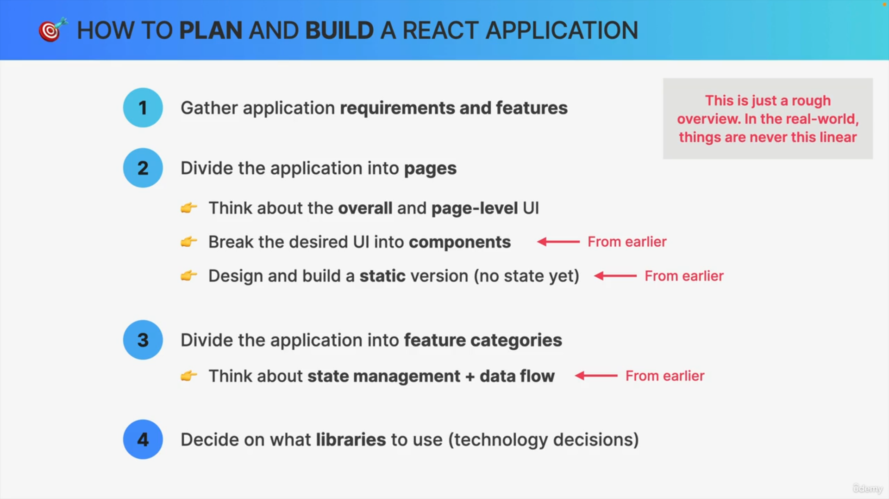

# React Best Practices and Concepts

---

# Table of Contents

1. [Application Planning](#application-planning)

2. [React Router v6 - Simplified Routing](#react-router-v6---simplified-routing)

   - [Example - Defining Routes in a Single Configuration](#example---defining-routes-in-a-single-configuration)

3. [Data Fetching with `useLoaderData`](#data-fetching-with-useloaderdata)

   - [Example - Fetching Data Using a Loader](#example---fetching-data-using-a-loader)
   - [Passing Route Parameters to Loader Functions](#passing-route-parameters-to-loader-functions)

4. [`useNavigation` Hook](#usenavigation-hook)

   - [Example - Tracking Loading State](#example---tracking-loading-state)
   - [Where It Is Used](#where-it-is-used)

5. [Handling Errors with `useRouteError`](#handling-errors-with-userouteerror)

   - [Example - Error Handling Component](#example---error-handling-component)
   - [Where It Can Be Used](#where-it-can-be-used)

---

## 📌 Application Planning

  
_(Diagram showing the structure and flow of the application)_

---

## 🚀 React Router v6 - Simplified Routing

With React Router v6, you no longer need to manually define routes using the legacy `<Route>` component. Instead, all routes can be defined in a single array and used with `RouterProvider`.  
Additionally, you can use the `Outlet` component to display child routes dynamically.

### Example - Defining Routes in a Single Configuration:

```jsx
import { createBrowserRouter, RouterProvider } from "react-router-dom";
import Home from "./ui/Home.jsx";
import Menu from "./features/menu/Menu.jsx";
import Cart from "./features/cart/Cart.jsx";
import CreateOrder from "./features/order/CreateOrder.jsx";
import Order from "./features/order/Order.jsx";
import AppLayout from "./ui/AppLayout.jsx";

const router = createBrowserRouter([
  {
    element: <AppLayout />,
    children: [
      { path: "/", element: <Home /> },
      { path: "/menu", element: <Menu /> },
      { path: "/cart", element: <Cart /> },
      { path: "/order/new", element: <CreateOrder /> },
      { path: "/order/:orderId", element: <Order /> },
    ],
  },
]);

function App() {
  return <RouterProvider router={router} />;
}

export default App;
```

---

## 🔄 Data Fetching with `useLoaderData`

React Router v6 introduces a **"render-as-you-fetch"** strategy using the `loader` function.  
Instead of using `useEffect` or Redux for API calls, you can fetch data directly inside the route configuration and access it using `useLoaderData`.

### Example - Fetching Data Using a Loader:

```jsx
import { useLoaderData } from "react-router-dom";
import { getMenu } from "../../services/apiRestaurant";

function Menu() {
  const menu = useLoaderData();
  return <h1>Menu</h1>;
}

export const loader = async () => {
  const menu = await getMenu();
  return menu;
};

export default Menu;
```

To use this loader in the route configuration:

```jsx
{
  path: "/menu",
  element: <Menu />,
  loader: menuLoader,
}
```

---

### Passing Route Parameters to Loader Functions

Loader functions can also receive route parameters, allowing dynamic data fetching based on the URL.

```jsx
export const previousOrder = async ({ params }) => {
  const order = await getOrder(params.orderId);
  return order;
};
```

## 🔍 `useNavigation` Hook

The `useNavigation` hook allows you to track the state of navigation, making it easy to handle loading states dynamically.

### Example - Tracking Loading State:

```jsx
const navigation = useNavigation();
const isLoading = navigation.state === "loading";
```

### Where It Is Used:

```jsx
const AppLayout = () => {
  const navigation = useNavigation();
  const isLoading = navigation.state === "loading";

  return (
    <div className="layout">
      {isLoading && <Loader />}
      <Header />
      <main>
        <Outlet />
      </main>
      <CartOverview />
    </div>
  );
};
```

---

## ❗️ Handling Errors with `useRouteError`

The `useRouteError` hook helps display errors on a specific route. You can define an error page and use this hook to retrieve and display route-specific errors.

### Example - Error Handling Component:

```jsx
import { useNavigate, useRouteError } from "react-router-dom";

function NotFound() {
  const navigate = useNavigate();
  const error = useRouteError();

  return (
    <div>
      <h1>Something went wrong 😢</h1>
      <p>{error.data || error.message}</p>
      <button onClick={() => navigate(-1)}>&larr; Go back</button>
    </div>
  );
}

export default NotFound;
```

### Where It Can Be Used:

```jsx
const router = createBrowserRouter([
  {
    element: <AppLayout />,
    errorElement: <NotFound />,
    children: [
      { path: "/", element: <Home /> },
      {
        path: "/menu",
        element: <Menu />,
        loader: menuLoader,
        errorElement: <NotFound />,
      },
    ],
  },
]);
```

---

## 📚 Conclusion

- **React Router v6** simplifies routing with a declarative API.
- The **loader** function enables **fetch-as-you-render** for better performance.
- The **useNavigation** hook allows tracking of navigation states.
- The **useRouteError** hook helps manage errors efficiently.

This guide provides an overview of implementing React Router v6 with modern best practices.

Happy coding! ✨
