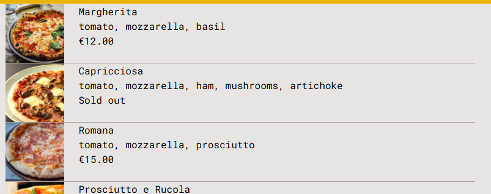
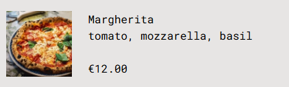

# React Best Practices and Concepts

---

## Table of Contents

1. [Application Planning](#application-planning)

2. [React Router v6 - Simplified Routing](#react-router-v6---simplified-routing)

   - [Example - Defining Routes in a Single Configuration](#example---defining-routes-in-a-single-configuration)

3. [Data Fetching with `useLoaderData`](#data-fetching-with-useloaderdata)

   - [Example - Fetching Data Using a Loader](#example---fetching-data-using-a-loader)
   - [Passing Route Parameters to Loader Functions](#passing-route-parameters-to-loader-functions)

4. [`useNavigation` Hook](#usenavigation-hook)

   - [Example - Tracking Loading State](#example---tracking-loading-state)
   - [Where It Is Used](#where-it-is-used)

5. [Handling Errors with `useRouteError`](#handling-errors-with-userouteerror)

   - [Example - Error Handling Component](#example---error-handling-component)
   - [Where It Can Be Used](#where-it-can-be-used)

6. [Setting Up Action in React Router](#setting-up-action-in-react-router)

   - [Example Route Setup](#example-route-setup)
   - [Creating the Action Function](#creating-the-action-function)
   - [Form Component for Submitting Data](#form-component-for-submitting-data)
   - [Passing Data with a Hidden Input Field](#passing-data-with-a-hidden-input-field)
   - [Using the Data Inside the Action Function](#using-the-data-inside-the-action-function)
   - [`useActionData` Hook](#useactiondata-hook)

7. Tailwind CSS

   - [Divide Property](#divide-property)
   - [Margin Auto (`m-auto`)](#margin-auto-m-auto)
   - [GrayScale](#grayscale)

8. [Redux Store](#redux-store)

   - [Selector Function](#selector-function)
   - [Redux Toolkit Thunks](#redux-toolkit-thunks)

9. [Use Fetcher Hook `useFetcher()`](#use-fetcher-hook-usefetcher)

   - [Fetching Data with `useFetcher`](#fetching-data-with-usefetcher)
   - [Updating Data with `useFetcher.Form`](#updating-data-with-usefetcherform)

---

## 1. Application Planning

  
_(Diagram showing the structure and flow of the application)_

---

## 2. React Router v6 - Simplified Routing

With React Router v6, you no longer need to manually define routes using the legacy `<Route>` component. Instead, all routes can be defined in a single array and used with `RouterProvider`.  
Additionally, you can use the `Outlet` component to display child routes dynamically.

### Example - Defining Routes in a Single Configuration:

```jsx
import { createBrowserRouter, RouterProvider } from "react-router-dom";
import Home from "./ui/Home.jsx";
import Menu from "./features/menu/Menu.jsx";
import Cart from "./features/cart/Cart.jsx";
import CreateOrder from "./features/order/CreateOrder.jsx";
import Order from "./features/order/Order.jsx";
import AppLayout from "./ui/AppLayout.jsx";

const router = createBrowserRouter([
  {
    element: <AppLayout />,
    children: [
      { path: "/", element: <Home /> },
      { path: "/menu", element: <Menu /> },
      { path: "/cart", element: <Cart /> },
      { path: "/order/new", element: <CreateOrder /> },
      { path: "/order/:orderId", element: <Order /> },
    ],
  },
]);

function App() {
  return <RouterProvider router={router} />;
}

export default App;
```

---

## 3. Data Fetching with `useLoaderData`

React Router v6 introduces a **"render-as-you-fetch"** strategy using the `loader` function.  
Instead of using `useEffect` or Redux for API calls, you can fetch data directly inside the route configuration and access it using `useLoaderData`.

### Example - Fetching Data Using a Loader:

```jsx
import { useLoaderData } from "react-router-dom";
import { getMenu } from "../../services/apiRestaurant";

function Menu() {
  const menu = useLoaderData();
  return <h1>Menu</h1>;
}

export const loader = async () => {
  const menu = await getMenu();
  return menu;
};

export default Menu;
```

To use this loader in the route configuration:

```jsx
{
  path: "/menu",
  element: <Menu />,
  loader: menuLoader,
}
```

---

### Passing Route Parameters to Loader Functions

Loader functions can also receive route parameters, allowing dynamic data fetching based on the URL.

```jsx
export const previousOrder = async ({ params }) => {
  const order = await getOrder(params.orderId);
  return order;
};
```

## 4. `useNavigation` Hook

The `useNavigation` hook allows you to track the state of navigation, making it easy to handle loading states dynamically.

### Example - Tracking Loading State:

```jsx
const navigation = useNavigation();
const isLoading = navigation.state === "loading";
```

### Where It Is Used:

```jsx
const AppLayout = () => {
  const navigation = useNavigation();
  const isLoading = navigation.state === "loading";

  return (
    <div className="layout">
      {isLoading && <Loader />}
      <Header />
      <main>
        <Outlet />
      </main>
      <CartOverview />
    </div>
  );
};
```

---

## 5. Handling Errors with `useRouteError`

The `useRouteError` hook helps display errors on a specific route. You can define an error page and use this hook to retrieve and display route-specific errors.

### Example - Error Handling Component:

```jsx
import { useNavigate, useRouteError } from "react-router-dom";

function NotFound() {
  const navigate = useNavigate();
  const error = useRouteError();

  return (
    <div>
      <h1>Something went wrong 😢</h1>
      <p>{error.data || error.message}</p>
      <button onClick={() => navigate(-1)}>&larr; Go back</button>
    </div>
  );
}

export default NotFound;
```

### Where It Can Be Used:

```jsx
const router = createBrowserRouter([
  {
    element: <AppLayout />,
    errorElement: <NotFound />,
    children: [
      { path: "/", element: <Home /> },
      {
        path: "/menu",
        element: <Menu />,
        loader: menuLoader,
        errorElement: <NotFound />,
      },
    ],
  },
]);
```

---

## 6. Setting Up Action in React Router

In React Router, actions are triggered when a component submits data, such as sending a POST request to an API. You can use the `Form` component from React Router to handle the form submission. You can specify the HTTP method (POST, PUT, DELETE, etc.) in the form element.

To handle this action in your application, you can specify it in the routes object within your `App.js` file. Pass the action and the corresponding function that handles form data submission.

### Here’s an example of how to set up the action in the routes:

```jsx
      {
        path: "/order/new",
        element: <CreateOrder />,
        action: createOrderAction,
      },
```

### Creating the Action Function

Now, you’ll define the action function that handles the form submission. This function typically extracts data from the form, processes it, and then calls an API or server function to handle the request.

```jsx
import { redirect } from "react-router-dom";
import { createOrder } from "./apiRestaurant";

export const createOrderAction = async ({ request }) => {
  //  Get the data from the form sent in the request
  const formData = await request.formData();

  //  Convert the FormData object into a plain JavaScript object
  const data = Object.fromEntries(formData);
  //   console.log(data)

  const order = {
    ...data,
    // Parse the cart string into an object (it was likely a JSON string)
    cart: JSON.parse(data.cart),

    priority: data.priority === "on",
  };
  //   console.log(order)

  // Call the createOrder function (likely an API request) to save the order on the server
  const newOrder = await createOrder(order);

  // After creating the order, redirect the user to the order details page using the order's ID
  // The redirect function takes the user to the path 'order/{id}', where 'id' is the ID of the newly created order
  return redirect(`/order/${newOrder.id}`);
};
```

### Form Component for Submitting Data

Here’s an example of the form component that submits data to the API:

```jsx
<Form method="POST">
  <div>
    <label>First Name</label>
    <input type="text" name="customer" required />
  </div>

  <div>
    <label>Phone number</label>
    <div>
      <input type="tel" name="phone" required />
    </div>
  </div>

  <div>
    <label>Address</label>
    <div>
      <input type="text" name="address" required />
    </div>
  </div>

  <div>
    <input
      type="checkbox"
      name="priority"
      id="priority"
      // value={withPriority}
      // onChange={(e) => setWithPriority(e.target.checked)}
    />
    <label htmlFor="priority">Want to yo give your order priority?</label>
  </div>

  <div>
    <button>Order now</button>
  </div>
</Form>
```

### Passing Data with a Hidden Input Field

Another neat trick to pass additional data on form submission is by using a hidden input field. You can pass serialized data (e.g., a JSON string) within the hidden field:

```jsx
<input type="hidden" name="cartData" value={JSON.stringify(cart)} />
```

### Using the Data Inside the Action Function

Once the form is submitted, the action function can access the hidden input's data. You can process this data just like any other form data.

```jsx
const cartData = formData.get("cartData"); // Extract hidden input data
const cart = JSON.parse(cartData); // Use the data as needed
```

### `useActionData` hook

Similar to the `useLoaderData` hook, the `useActionData` hook allows you to access the data returned from an action, such as when a POST, PUT, or DELETE request occurs.

```jsx
const data = useActionData();
```

---

## 7. Tailwind css

### Divide property

The divide property in CSS is used to create visual separation between elements by adding lines. For example, the following code creates horizontal dividers with a specific color:

```css
divide-y divide-stone-400
```

This results in a layout with dividing lines between the elements, as shown below:



### Margin Auto `m-auto`

The m-auto class in Tailwind CSS is a useful technique for aligning or positioning elements within containers. In the example below, it is used to push the last item to the bottom of a flex container.

```jsx
<div className="flex flex-col">
  <p>{name}</p>
  <p>{ingredients.join(", ")}</p>
  <div className="mt-auto">
    {!soldOut ? <p>{formatCurrency(unitPrice)}</p> : <p>Sold out</p>}
  </div>
</div>
```

In this example, the flex container is set to a column direction (flex-col), containing three elements. By applying mt-auto to the last element, it pushes that item to the bottom of the container. The result looks like this:



### GrayScale

Another usefull thing
we can use conditinal rendering to make imgae grayscale like this

```jsx

```

here is an image example


---

## 8. Redux Store

### Selector Function

Instead of directly calling or destructuring state using useSelector in a component, we can use selector functions for better reusability and maintainability.

Here’s an example:

```jsx
import { createSlice } from "@reduxjs/toolkit";

const initialState = {
  //   cart: [],

  cart: [],
};

const cartSlice = createSlice({
  name: "cart",
  initialState,
  reducers: {
    addItem(state, action) {
      state.cart.push(action.payload);
    },
    deleteItem(state, action) {
      state.cart = state.cart.filter((item) => item.pizzaId !== action.payload);
    },
    increaseItemQuantity(state, action) {
      const item = state.cart.find((item) => item.pizzaId === action.payload);
      item.quantity++;
      item.totalPrice = item.quantity * item.price;
    },
    decreaseItemQuantity(state, action) {
      const item = state.cart.find((item) => item.pizzaId === action.payload);
      item.quantity--;
      item.totalPrice = item.quantity * item.price;
    },
    clearCart(state) {
      state.cart = [];
    },
  },
});

export const {
  addItem,
  deleteItem,
  increaseItemQuantity,
  decreaseItemQuantity,
  clearCart,
} = cartSlice.actions;

// Selector functions

export const getCart = (state) => {
  return state.cart.cart;
};

export const getTotalQuantity = (state) => {
  return state.cart.cart.reduce((sum, item) => sum + item.quantity, 0);
};

export const getTotalPrice = (state) => {
  return state.cart.cart.reduce((sum, item) => sum + item.totalPrice, 0);
};

export const getCurrentQuantityById = (id) => (state) => {
  return state.cart.cart.find((item) => item.pizzaId === id)?.quantity ?? 0;
};

export default cartSlice.reducer;
```

### Redux toolkit thunks

expample :

```jsx
import { createAsyncThunk, createSlice } from "@reduxjs/toolkit";
import { getAddress } from "../../services/apiGeocoding";

// Function to get the user's geolocation
function getPosition() {
  return new Promise((resolve, reject) => {
    navigator.geolocation.getCurrentPosition(resolve, reject);
  });
}

// Async thunk to fetch user's address based on geolocation
export const fetchAddress = createAsyncThunk("user/fetchAddress", async () => {
  try {
    // 1) Get user's geolocation position using the browser's geolocation API
    const positionObj = await getPosition();
    const position = {
      latitude: positionObj.coords.latitude,
      longitude: positionObj.coords.longitude,
    };

    // 2) Use reverse geocoding API to retrieve address details from latitude and longitude
    const addressObj = await getAddress(position);
    const address = `${addressObj.locality}, ${addressObj.city} ${addressObj.postcode}, ${addressObj.countryName}`;

    // 3) Return an object containing the extracted position and address
    return { position, address };
  } catch (error) {
    throw new Error("Failed to fetch address");
  }
});

// Initial state for the Redux store
const initialState = {
  userName: "", // Stores the user's name
  status: "idle", // Represents the status of the async operation
  position: {}, // Stores the user's geolocation data
  address: "", // Stores the user's address retrieved from geolocation
  error: "", // Stores any error messages
};

// Create a Redux slice for managing user-related state
const userSlice = createSlice({
  name: "user",
  initialState,
  reducers: {
    // Reducer to update the user's name in the state
    updateName(state, action) {
      state.userName = action.payload;
    },
  },
  extraReducers: (builder) => {
    builder
      // Handle the pending state when fetchAddress is called
      .addCase(fetchAddress.pending, (state) => {
        state.status = "loading";
      })
      // Handle the fulfilled state when fetchAddress completes successfully
      .addCase(fetchAddress.fulfilled, (state, action) => {
        state.position = action.payload.position;
        state.address = action.payload.address;
        state.status = "idle";
      })
      // Handle the rejected state when fetchAddress fails
      .addCase(fetchAddress.rejected, (state, action) => {
        state.error = action.error.message;
        state.status = "error";
      });
  },
});

// Export actions to be used in components
export const { updateName } = userSlice.actions;

// Selector function to get the user's name from the state
export const getUserName = (state) => state.user.userName;

// Export reducer to be used in the Redux store
export default userSlice.reducer;
```

## 9. Use Fetcher hook `useFetcher()`

### Fetching Data with `useFetcher`

In some cases, we need to fetch data for a page that has already been loaded, without navigating to a new page.
This is where the `useFetcher` hook comes in handy—it allows us to load data from a different route without triggering navigation.

Example:

```jsx
const fetcher = useFetcher();

useEffect(() => {
  if (!fetcher.data && fetcher.state === "idle") {
    fetcher.load("/menu");
  }
}, [fetcher]);

console.log(fetcher.data);
```

### Updating Data with `useFetcher.From`

The `useFetcher` hook can also be used to update data, similar to how Redux handles state updates.
Instead of navigating away from the current page, `fetcher.Form` submits data in place, ensuring a smooth user experience.
This approach allows you to update data seamlessly without leaving the current page.

Example:

```jsx
import { useFetcher } from "react-router-dom";
import OrderButton from "../../ui/Buttons/OrderButton";
import { updateOrder } from "../../services/apiRestaurant";

const UpdateOrder = ({ order }) => {
  const fetcher = useFetcher();
  return (
    <fetcher.Form method="PATCH" className="text-right">
      <OrderButton type="primary">Make priority</OrderButton>
    </fetcher.Form>
  );
};

export const action = async ({ request, params }) => {
  const data = { priority: true };
  await updateOrder(params.orderId, data);
  return null;
};

export default UpdateOrder;
```
